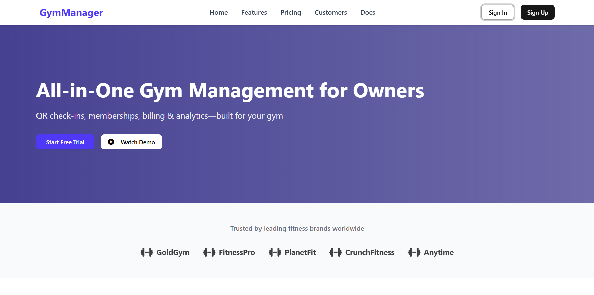
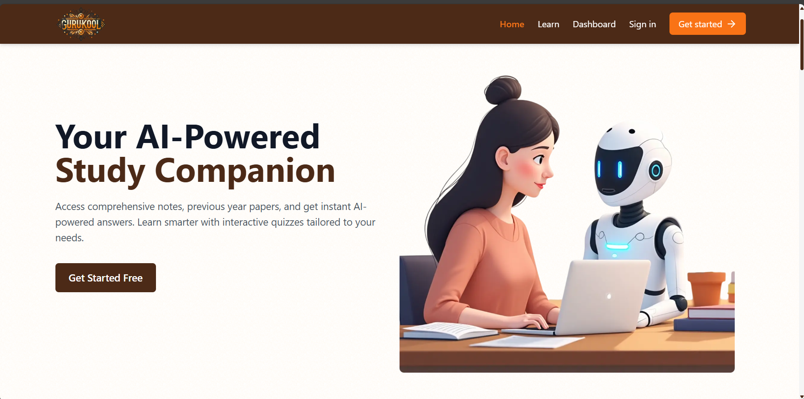

<!-- README.md for Manish Singh | Full-Stack Developer -->

  

  
  
  
  

 

<table width="100%">
  <tr>
    <td align="left" valign="middle">
      <h2>👋 Hi, I’m <strong>Manish Singh</strong></h2>
      <ul>
        <li>🛠️ <b>Full-Stack Developer</b> & Builder.</li>
        <li>🚀 Passionate about scalable SaaS, clean UI, and developer productivity.</li>
        <li>📦 <b>Key Projects:</b> <a href="https://repset-mu.vercel.app" target="_blank"><b>Repset</b></a> (modern gym management SaaS), <a href="https://gurukool.tech" target="_blank"><b>Gurukool</b></a> (AI-powered learning platform).</li>
        <li>🌱 Exploring automation, API design, and UI/UX excellence.</li>
      </ul>
    </td>
    <td align="center" width="185">
      
    </td>
  </tr>
</table>

---

<b>🚀 About Me</b>

 
<ul>
  <li>
    <b>Full-Stack Engineer:</b> Focused on building robust, maintainable, and delightful web experiences.
  </li>
  <li>
    <b>Skills:</b> React.js · Next.js · Node.js · TypeScript · Prisma · PostgreSQL · Tailwind · Docker · AWS
  </li>
  <li>
    <b>Project Highlights:</b> 
    <ul>
      <li><b>Repset</b> – Next-gen gym SaaS (multi-tenant, onboarding, clean UI)</li>
      <li><b>Gurukool</b> – AI-powered study and notes platform for students</li>
    </ul>
  </li>
  <li>
    <b>Other Projects:</b> Real-time chat apps, open-source UI, and performance tools.
  </li>
</ul>

---

<h3 align="center">🛠️ Tech Stack</h3>

   
  

---

<h3 align="center">📊 GitHub Stats</h3>

  

---

<h3 align="center">🚩 Projects</h3>

  
   
  <b><a href="https://repset-mu.vercel.app" target="_blank">Repset</a></b> – All-in-one gym management platform

  
   
  <b><a href="https://gurukool.tech" target="_blank">Gurukool</a></b> – AI-powered learning platform

---

<h3 align="center">🏆 Badges & Achievements</h3>

  

---

<h3 align="center">📌 What I'm Up To</h3>
<ul>
  <li>🚀 Building, scaling, and shipping modern SaaS products.</li>
  <li>⚡ Improving UI performance, accessibility, and user experience.</li>
  <li>💡 Exploring new frontend patterns, TypeScript, and cloud deployment.</li>
  <li>📚 Leveling up in DevOps (Docker + AWS + K8s) and system design.</li>
</ul>

---

  <a href="https://drive.google.com/file/d/1XRoJSCAaDV_Zj6Ho9wHd42vz-XFv4jQ6/view?usp=sharing" target="_blank"><b>📄 Resume (PDF)</b></a> •
  <a href="https://manishsingh.me" target="_blank"><b>🌐 Portfolio</b></a> •
  <a href="mailto:manishsingh13275@gmail.com"><b>✉️ Email</b></a> •
  <a href="https://www.linkedin.com/in/singh-manish1/" target="_blank"><b>🔗 LinkedIn</b></a>

---

### 🐍 GitHub Contribution Graph Snake

  <picture>
    <source media="(prefers-color-scheme: dark)" srcset="https://github.com/MAnishSingh13275/MAnishSingh13275/blob/output/github-contribution-grid-snake-dark.svg" />
    <source media="(prefers-color-scheme: light)" srcset="https://github.com/MAnishSingh13275/MAnishSingh13275/blob/output/github-contribution-grid-snake.svg" />
    
  </picture>

  
   
  <i>Made with ❤️ by Manish Singh</i>

